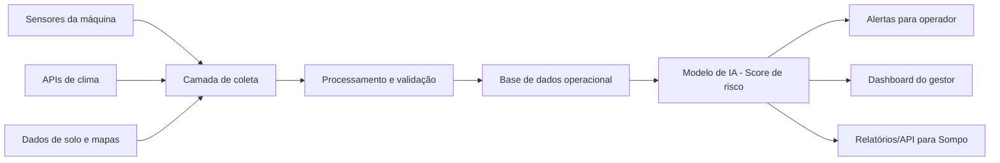

# SafeHarvest AI

### Previsão de riscos operacionais e ambientais para equipamentos agrícolas

Challenge Sompo Seguros | FIAP 2026 | Turma A | Tutora: Nicolly de Souza

---

## Sprint 2 — Inteligência de Dados

> A Sprint 2 transforma a estrutura conceitual da Sprint 1 em código funcional: dataset simulado com 5.000+ registros, banco de dados relacional, modelo Gradient Boosting treinado e validado (acurácia 97,9%), API REST com autenticação JWT e dashboard interativo.

### Evolução em relação à Sprint 1

| Aspecto      | Sprint 1                                            | Sprint 2                                                                                                  |
| ------------ | --------------------------------------------------- | --------------------------------------------------------------------------------------------------------- |
| Dados        | Dicionário de variáveis + CSV de exemplo (5 linhas) | Dataset simulado com 5.000+ registros gerado por script Python                                            |
| Banco SQL    | Schema conceitual descrito no README                | DDL Oracle/PostgreSQL executável com 5 tabelas + índices                                                  |
| Modelo de IA | Proposta com Random Forest                          | Gradient Boosting treinado, serializado (`risk_model.pkl`) e validado (acurácia 97,9%, MAE 5,82, F1 0,98) |
| Integração   | Diagrama de fluxo proposto                          | API Flask funcional + fluxo completo CSV → banco → modelo → dashboard                                     |
| Interface    | Wireframe descritivo por persona                    | Dashboard HTML/CSS/JS com telas Operador e Gestor/Analista                                                |
| Segurança    | Perfis de acesso definidos                          | JWT por perfil implementado + validação de ranges na API                                                  |

### Estrutura de arquivos (Sprint 2)

```text
SafeHarvest-AI/
├── ml/
│   ├── 01_generate_dataset.py     # Gera data/raw/sensor_data_simulated.csv (5.000+ registros)
│   ├── 02_eda_analysis.py         # Análise exploratória com gráficos em docs/
│   ├── 03_feature_engineering.py  # Encoding, normalização, features compostas
│   ├── 04_train_model.py          # Random Forest + Gradient Boosting (comparação)
│   ├── 05_evaluate_model.py       # Acurácia, MAE, RMSE, matriz de confusão, feature importance
│   ├── 06_ingest_to_db.py         # Ingestão CSV → banco SQL com validação e logs
│   └── models/
│       ├── risk_model.pkl         # Modelo serializado (Gradient Boosting)
│       ├── feature_names.pkl      # Nomes das features usadas no treinamento
│       ├── scaler.pkl             # MinMaxScaler ajustado no treino
│       └── feature_meta.pkl       # Metadados para reprodução das features compostas
│
├── database/
│   ├── schema.sql                 # DDL Oracle XE / PostgreSQL (5 tabelas + índices)
│   ├── seed_data.sql              # Equipamentos e usuários demo
│   └── queries/
│       ├── insert_leitura.sql
│       ├── get_risco_equipamento.sql
│       └── dashboard_metrics.sql
│
├── api/
│   ├── app.py                     # API Flask com JWT por perfil (operador/gestor/analista)
│   └── requirements.txt
│
├── frontend/
│   ├── index.html                 # Dashboard com login, visão operador e visão gestor
│   ├── styles.css
│   └── app.js
│
├── notebooks/
│   └── analise_exploratoria.ipynb # EDA completa com 9 seções comentadas
│
└── data/
    ├── raw/sensor_data_simulated.csv
    └── processed/                 # Gerado por 03_feature_engineering.py
```

### Como executar

#### 1. Instalar dependências

```bash
pip install -r api/requirements.txt
pip install flask-cors
```

#### 2. Gerar dataset e treinar modelo

```bash
python ml/01_generate_dataset.py
python ml/03_feature_engineering.py
python ml/04_train_model.py
python ml/05_evaluate_model.py
```

#### 3. Banco de dados (Oracle XE ou PostgreSQL)

```bash
# Oracle XE:
sqlplus usuario/senha@localhost @database/schema.sql
sqlplus usuario/senha@localhost @database/seed_data.sql

# Ingestão do CSV no banco:
DB_TYPE=oracle DB_USER=fiap DB_PASS=fiap123 python ml/06_ingest_to_db.py
```

#### 4. Iniciar a API

```bash
cd api && flask run
# API disponível em http://localhost:5000
```

#### 5. Abrir o dashboard

Abra `frontend/index.html` no navegador. Contas demo:

| Usuário          | Senha      | Perfil           |
| ---------------- | ---------- | ---------------- |
| `operador_01`    | `op01pass` | Operador (EQ001) |
| `gestor_frota`   | `gestpass` | Gestor de frota  |
| `analista_sompo` | `anlpass`  | Analista Sompo   |

### Endpoints da API

| Método | Endpoint                   | Perfil          | Descrição                              |
| ------ | -------------------------- | --------------- | -------------------------------------- |
| POST   | `/api/auth/login`          | Público         | Autenticação e geração do token JWT    |
| POST   | `/api/predict`             | Todos           | Predição de risco para uma leitura     |
| GET    | `/api/equipamentos/riscos` | Todos           | Último risco calculado por equipamento |
| GET    | `/api/dashboard/summary`   | Gestor/Analista | Resumo dos últimos 7 dias              |
| GET    | `/api/alertas?nivel=ALTO`  | Todos           | Alertas ativos filtráveis por nível    |
| GET    | `/api/health`              | Público         | Health check da API                    |

### Diagrama de arquitetura


### Resultado do modelo (valores obtidos)

| Métrica                   | Meta        | Resultado       |
| ------------------------- | ----------- | --------------- |
| Acurácia                  | ≥ 85%       | **97,9%**       |
| MAE do score (0–100)      | ≤ 10 pontos | **5,82 pontos** |
| RMSE do score (0–100)     | ≤ 14 pontos | **6,83 pontos** |
| F1-score médio (weighted) | ≥ 0,84      | **0,98**        |

Algoritmo selecionado: **Gradient Boosting** (superou Random Forest com 94,5% de acurácia).

Top 3 features mais importantes: `distancia_agua_m` (0,357), `umidade_solo_pct` (0,225), `indice_instabilidade` (0,185).

### Checklist de entrega — Sprint 2

- [x] `ml/01_generate_dataset.py` — dataset com 5.000+ registros
- [x] `database/schema.sql` — DDL completo com 5 tabelas + índices
- [x] `ml/06_ingest_to_db.py` — ingestão CSV → banco SQL com logs
- [x] `notebooks/analise_exploratoria.ipynb` — EDA comentada
- [x] `ml/04_train_model.py` — Random Forest + Gradient Boosting
- [x] `ml/05_evaluate_model.py` — acurácia, MAE, RMSE, matriz de confusão, feature importance
- [x] `api/app.py` — API Flask com JWT por perfil, CORS e validação de ranges
- [x] `frontend/` — dashboard com telas Operador e Gestor
- [x] `docs/matriz_confusao.png` — gerado ao executar `05_evaluate_model.py`
- [x] `docs/feature_importance.png` — gerado ao executar `05_evaluate_model.py`
- [x] `ml/models/risk_model.pkl` — Gradient Boosting serializado (acurácia 97,9%)
- [x] `docs/arquitetura_sprint2.png` — diagrama de arquitetura consolidado

---

## Sprint 1 — Documentação e Proposta

> Projeto acadêmico desenvolvido para a Sprint 1 do Challenge Sompo. Nesta etapa, o objetivo é documentar a proposta da solução, estruturar os dados, definir a arquitetura inicial, apresentar user stories e planejar a evolução até um protótipo funcional.

## 1. Contexto do desafio

A Sompo Seguros atua com soluções de seguros, análise de riscos e inovação tecnológica. No contexto agrícola, equipamentos como tratores, colheitadeiras, pulverizadores e implementos operam em ambientes sujeitos a variações de clima, solo, relevo, visibilidade, proximidade de água e condições de transporte.

O desafio proposto pela FIAP é desenvolver uma solução baseada em dados e Inteligência Artificial capaz de identificar, prever e reduzir riscos operacionais e ambientais relacionados ao uso desses equipamentos. A proposta deve apoiar decisões preventivas, reduzindo perdas, danos mecânicos, paradas operacionais e sinistros.

## 2. Problema de negócio

Atualmente, muitas decisões em operações agrícolas ainda são tomadas de forma reativa. O operador ou gestor só identifica o risco quando o equipamento já está em uma condição crítica, como solo encharcado, declive acentuado, rota insegura, proximidade de rios ou presença de obstáculos.

Exemplos de situações de risco:

- Colheitadeira operando próxima a um rio após chuva intensa.
- Trator transportado em rota com solo instável ou baixa visibilidade.
- Equipamento operando em área com declive elevado e carga pesada.
- Máquina trafegando em campo com obstáculos não mapeados.
- Operação realizada sem considerar histórico de incidentes da área.

Esses cenários podem gerar:

- Danos mecânicos.
- Perda parcial ou total do equipamento.
- Parada da operação agrícola.
- Risco à segurança do operador.
- Aumento do custo de sinistros para a seguradora.
- Redução da eficiência operacional da fazenda.

O problema central é a baixa previsibilidade de riscos operacionais e ambientais antes da tomada de decisão em campo.

## 3. Objetivo da solução

O SafeHarvest AI tem como objetivo apoiar operadores, gestores agrícolas e seguradoras na identificação antecipada de riscos, gerando alertas preventivos e recomendações baseadas em dados.

A solução proposta deverá:

- Integrar dados ambientais, operacionais, geográficos e históricos.
- Calcular um score de risco por equipamento, região ou operação.
- Classificar o risco em níveis de severidade.
- Gerar alertas preventivos para operadores.
- Apoiar gestores na priorização de rotas, operações e manutenção.
- Fornecer dados agregados para análise de risco da seguradora.

## 4. Solução proposta

O SafeHarvest AI será uma plataforma de apoio à decisão para operações agrícolas. A solução receberá dados de sensores, APIs externas e bases internas, processará essas informações e usará um modelo preditivo para estimar o risco de eventos como atolamento, tombamento e colisão com obstáculos.

### Saídas esperadas

| Saída             | Descrição                                | Exemplo                                           |
| ----------------- | ---------------------------------------- | ------------------------------------------------- |
| Score de risco    | Valor numérico de 0 a 100                | 87/100                                            |
| Classe de risco   | Classificação interpretável              | Baixo, Médio, Alto ou Crítico                     |
| Alerta preventivo | Mensagem objetiva para tomada de decisão | "Risco alto de atolamento no talhão 04"           |
| Recomendação      | Ação sugerida para reduzir o risco       | "Adiar operação por 24h ou usar rota alternativa" |
| Relatório/API     | Dados agregados para gestão e seguradora | Média de risco por região, máquina e período      |

### Módulos da solução

| Módulo                | Função                                                           |
| --------------------- | ---------------------------------------------------------------- |
| Coleta de dados       | Receber dados de sensores, clima, solo, localização e histórico  |
| Processamento         | Limpar, padronizar e organizar os dados                          |
| Base operacional      | Armazenar registros de equipamentos, operações, alertas e riscos |
| Modelo de IA          | Calcular score e classe de risco                                 |
| Interface do operador | Exibir alertas simples e recomendações imediatas                 |
| Dashboard do gestor   | Monitorar frota, talhões, alertas e histórico                    |
| API/relatório Sompo   | Apoiar análise de risco, prevenção e precificação                |

## 5. Personas

### João - Operador de colheitadeira

João atua diretamente em campo e precisa de informações simples, rápidas e acionáveis. Durante a operação, ele não pode interpretar gráficos complexos nem analisar relatórios extensos.

Necessidades:

- Receber alertas visuais e sonoros.
- Saber qual é o risco principal.
- Entender a recomendação de forma objetiva.
- Evitar áreas inseguras antes de entrar nelas.

### Ana - Gestora de frota agrícola

Ana acompanha a operação de vários equipamentos ao mesmo tempo. Ela precisa priorizar decisões, planejar rotas, reduzir paradas e manter a produtividade da fazenda.

Necessidades:

- Visualizar risco por equipamento e região.
- Comparar áreas de operação.
- Consultar histórico de alertas.
- Planejar manutenção preventiva.
- Decidir se uma operação deve continuar, ser ajustada ou adiada.

### Carlos - Analista de risco da Sompo

Carlos precisa entender padrões de risco e sinistralidade para apoiar decisões da seguradora. Ele não atua diretamente na operação, mas precisa de dados agregados e confiáveis.

Necessidades:

- Consultar dados consolidados por região, equipamento e tipo de operação.
- Identificar padrões de risco recorrentes.
- Apoiar precificação e prevenção de sinistros.
- Avaliar a efetividade das recomendações preventivas.

## 6. User stories

| Persona        | User story                                                                                                                     | Critério de aceite                                                                                      |
| -------------- | ------------------------------------------------------------------------------------------------------------------------------ | ------------------------------------------------------------------------------------------------------- |
| Operador       | Como operador, quero receber um alerta simples quando o risco de atolamento for alto, para evitar entrar em uma área insegura. | O sistema deve exibir nível de risco, motivo do alerta e recomendação objetiva.                         |
| Operador       | Como operador, quero visualizar se a rota atual é segura, para reduzir o risco durante a operação.                             | O sistema deve indicar trechos de maior risco e sugerir rota alternativa quando existir.                |
| Operador       | Como operador, quero receber aviso de obstáculo à frente, para evitar colisão com árvores, cercas, pedras ou outros objetos.   | O sistema deve informar tipo aproximado do obstáculo, distância estimada e nível de risco.              |
| Gestora        | Como gestora de frota, quero acompanhar o risco por equipamento e talhão, para priorizar decisões operacionais.                | O dashboard deve listar máquinas, regiões, risco atual e recomendação.                                  |
| Gestora        | Como gestora de frota, quero consultar histórico de alertas, para planejar manutenção, treinamento e ajustes de operação.      | O sistema deve permitir filtro por período, operador, equipamento, região e tipo de risco.              |
| Analista Sompo | Como analista de risco, quero acessar dados agregados de operação e risco, para apoiar precificação e prevenção de sinistros.  | A solução deve gerar relatório ou API com score médio, frequência de alertas e fatores mais relevantes. |

## 7. Riscos monitorados

| Risco                  | Descrição                                                                                                              | Dados de entrada                                                                                        | Saída esperada                                                               |
| ---------------------- | ---------------------------------------------------------------------------------------------------------------------- | ------------------------------------------------------------------------------------------------------- | ---------------------------------------------------------------------------- |
| Atolamento             | Ocorre quando o equipamento opera em solo instável, encharcado ou com baixa capacidade de suporte.                     | Chuva acumulada, umidade do solo, tipo de solo, peso da máquina, histórico da área e distância de água. | Score de risco, alerta e recomendação de adiar operação ou alterar rota.     |
| Tombamento             | Ocorre quando o equipamento opera em declive, inclinação lateral elevada, velocidade inadequada ou com carga instável. | Declividade, inclinação lateral, velocidade, carga, tipo de operação e relevo.                          | Score de risco, alerta de redução de velocidade ou bloqueio de trecho.       |
| Colisão com obstáculos | Ocorre quando há árvores, cercas, pedras, troncos, postes ou outros objetos no trajeto.                                | Câmera frontal, GPS, mapa de obstáculos, velocidade e rota.                                             | Alerta visual/sonoro, distância estimada e recomendação de desvio ou parada. |
| Transporte inseguro    | Ocorre durante deslocamento entre áreas ou transporte em vias com condições adversas.                                  | Rota, velocidade, clima, visibilidade, tipo de via e peso transportado.                                 | Classificação de risco da rota e recomendação de ajuste.                     |

## 8. Dados utilizados

Nesta Sprint 1, os dados serão simulados para representar cenários reais de operação agrícola. Em etapas futuras, esses dados poderão ser substituídos ou complementados por APIs, sensores e bases históricas.

### Fontes previstas

| Fonte                   | Exemplos de dados                                           | Uso na solução                             |
| ----------------------- | ----------------------------------------------------------- | ------------------------------------------ |
| Sensores do equipamento | GPS, velocidade, inclinação, aceleração, carga e telemetria | Avaliar condição operacional em tempo real |
| APIs climáticas         | Chuva, previsão do tempo, temperatura e umidade             | Identificar risco ambiental                |
| Dados de solo           | Tipo de solo, umidade estimada e capacidade de drenagem     | Estimar risco de atolamento                |
| Dados geográficos       | Distância de rios, declividade, talhões e rotas             | Avaliar exposição ambiental                |
| Câmera frontal          | Imagens de obstáculos no trajeto                            | Detectar risco de colisão                  |
| Histórico operacional   | Incidentes anteriores, alertas e manutenção                 | Identificar padrões recorrentes            |

## 9. Dataset simulado

Um exemplo de dataset foi incluído em [`data/simulated/equipment_risk_sample.csv`](data/simulated/equipment_risk_sample.csv).

| equipamento_id | tipo_equipamento | tipo_operacao | chuva_48h_mm | umidade_solo_pct | tipo_solo | distancia_agua_m | declividade_graus | velocidade_kmh | obstaculo_detectado | risco_score | risco_classe |
| -------------- | ---------------- | ------------- | -----------: | ---------------: | --------- | ---------------: | ----------------: | -------------: | ------------------- | ----------: | ------------ |
| COLH-001       | colheitadeira    | colheita      |           68 |               84 | argiloso  |               90 |                 6 |            5.2 | false               |          88 | Alto         |
| TRAT-002       | trator           | transporte    |           12 |               39 | arenoso   |              450 |                 4 |           18.0 | false               |          31 | Baixo        |
| PULV-003       | pulverizador     | pulverizacao  |           34 |               61 | misto     |              210 |                12 |            9.5 | true                |          72 | Alto         |
| COLH-004       | colheitadeira    | colheita      |            4 |               28 | arenoso   |              800 |                 3 |            6.0 | false               |          18 | Baixo        |
| TRAT-005       | trator           | preparo_solo  |           52 |               76 | argiloso  |              130 |                15 |           11.0 | true                |          94 | Critico      |

## 10. Dicionário de variáveis

| Variável                  | Tipo      | Descrição                                     | Exemplo        |
| ------------------------- | --------- | --------------------------------------------- | -------------- |
| registro_id               | Texto     | Identificador único do registro               | R001           |
| equipamento_id            | Texto     | Identificador do equipamento                  | COLH-001       |
| tipo_equipamento          | Categoria | Tipo de máquina agrícola                      | colheitadeira  |
| tipo_operacao             | Categoria | Operação em execução                          | colheita       |
| latitude                  | Número    | Latitude aproximada da operação               | -22.9121       |
| longitude                 | Número    | Longitude aproximada da operação              | -47.0623       |
| chuva_48h_mm              | Número    | Chuva acumulada nas últimas 48 horas          | 68             |
| umidade_solo_pct          | Número    | Percentual estimado de umidade do solo        | 84             |
| tipo_solo                 | Categoria | Classificação simplificada do solo            | argiloso       |
| distancia_agua_m          | Número    | Distância aproximada até rio, lago ou represa | 90             |
| declividade_graus         | Número    | Inclinação do terreno em graus                | 15             |
| inclinacao_lateral_graus  | Número    | Inclinação lateral medida ou estimada         | 9              |
| velocidade_kmh            | Número    | Velocidade atual do equipamento               | 11.0           |
| peso_carga_kg             | Número    | Peso estimado da carga ou implemento          | 4200           |
| obstaculo_detectado       | Booleano  | Indica se há obstáculo identificado           | true           |
| distancia_obstaculo_m     | Número    | Distância estimada até o obstáculo            | 45             |
| historico_incidentes_area | Número    | Quantidade de incidentes anteriores na região | 3              |
| risco_score               | Número    | Score final calculado pelo modelo             | 94             |
| risco_classe              | Categoria | Classe de risco final                         | Critico        |
| recomendacao              | Texto     | Ação preventiva sugerida                      | Adiar operação |

## 11. Exploração inicial dos dados

Na próxima sprint, a análise exploratória deverá buscar relações entre variáveis ambientais, operacionais e eventos de risco.

Análises previstas:

- Correlação entre chuva acumulada, umidade do solo e risco de atolamento.
- Relação entre declividade, inclinação lateral, velocidade e risco de tombamento.
- Frequência de alertas por tipo de equipamento.
- Distribuição de risco por tipo de solo.
- Comparação de risco por tipo de operação.
- Identificação de áreas com histórico recorrente de incidentes.

## 12. Modelo preditivo proposto

Para a primeira versão funcional, a proposta é utilizar um modelo de classificação de risco combinado com um score numérico.

### Entrada do modelo

O modelo receberá dados ambientais, operacionais, geográficos e históricos:

- Chuva acumulada.
- Umidade do solo.
- Tipo de solo.
- Proximidade de água.
- Declividade.
- Inclinação lateral.
- Velocidade.
- Peso da carga.
- Obstáculo detectado.
- Histórico de incidentes.
- Tipo de equipamento.
- Tipo de operação.

### Saída do modelo

O modelo deverá gerar:

- `risco_score`: valor de 0 a 100.
- `risco_classe`: Baixo, Médio, Alto ou Crítico.
- Principais fatores de risco.
- Recomendação preventiva.

### Abordagem inicial

Na Sprint 1, a abordagem ainda é conceitual. Para as próximas etapas, a evolução recomendada é:

1. Criar uma regra inicial de score com pesos definidos pelo grupo.
2. Usar essa regra para gerar dados simulados rotulados.
3. Treinar um modelo baseline, como Regressão Logística ou Árvore de Decisão.
4. Evoluir para Random Forest ou XGBoost caso o volume de dados justifique.
5. Adicionar visão computacional para detecção de obstáculos em uma etapa posterior.

### Justificativa técnica

A classificação de risco é adequada porque o objetivo principal é apoiar uma decisão preventiva. O usuário precisa saber se deve continuar, reduzir velocidade, mudar rota ou adiar a operação. O score numérico facilita priorização, enquanto a classe de risco torna a saída mais simples para operadores e gestores.

## 13. Arquitetura da solução



### Componentes

| Componente                | Responsabilidade                                                  |
| ------------------------- | ----------------------------------------------------------------- |
| Sensores da máquina       | Coletar GPS, velocidade, inclinação, aceleração e carga           |
| APIs externas             | Fornecer clima, chuva e previsão meteorológica                    |
| Dados de solo e mapas     | Informar tipo de solo, talhões, declividade e proximidade de água |
| Camada de coleta          | Integrar dados de diferentes fontes                               |
| Processamento e validação | Limpar, padronizar e verificar consistência dos dados             |
| Base de dados operacional | Armazenar operações, equipamentos, alertas e histórico            |
| Modelo de IA              | Calcular risco e gerar classificação                              |
| App do operador           | Exibir alertas imediatos e recomendações simples                  |
| Dashboard do gestor       | Exibir visão consolidada da operação                              |
| API/relatórios Sompo      | Disponibilizar dados agregados para análise de risco              |

## 14. Interface e aplicação

### Operador

Interface simples em tablet ou celular embarcado no equipamento.

Informações exibidas:

- Cor do risco atual.
- Score de risco.
- Tipo de risco principal.
- Motivo do alerta.
- Recomendação objetiva.

Exemplo:

> Risco Crítico - 94/100  
> Motivo: solo argiloso, chuva alta e declividade elevada.  
> Recomendação: parar operação e aguardar nova avaliação.

### Gestora de frota

Dashboard web com visão operacional.

Informações exibidas:

- Lista de equipamentos em operação.
- Risco por máquina.
- Mapa de calor por talhão.
- Histórico de alertas.
- Filtros por data, operador, equipamento e tipo de risco.

### Analista Sompo

Painel ou API com dados agregados.

Informações exibidas:

- Score médio por região.
- Frequência de alertas por tipo de equipamento.
- Principais fatores de risco.
- Histórico por período.
- Relatórios para apoio à análise de risco.

## 15. Segurança e governança dos dados

A solução deverá considerar segurança desde a concepção.

Medidas propostas:

- Autenticação de usuários.
- Controle de acesso por perfil: operador, gestor, analista Sompo e administrador.
- Registro de logs de acesso e alterações.
- Validação de dados recebidos de sensores e APIs.
- Trilha de auditoria para alertas e recomendações geradas.
- Proteção de dados sensíveis conforme princípios da LGPD.
- Armazenamento seguro das informações operacionais.
- Separação entre dados individuais da fazenda e dados agregados para seguradora.

## 16. Planejamento das próximas etapas

| Sprint   | Entrega prevista                                                                                                 |
| -------- | ---------------------------------------------------------------------------------------------------------------- |
| Sprint 1 | Documentação da proposta, personas, user stories, dados simulados, arquitetura, modelo conceitual e planejamento |
| Sprint 2 | Ampliação do dataset simulado, análise exploratória e criação da primeira regra de score                         |
| Sprint 3 | Treinamento de modelo preditivo inicial e avaliação com métricas                                                 |
| Sprint 4 | Desenvolvimento de protótipo de dashboard e tela de alerta do operador                                           |
| Sprint 5 | Integração do protótipo, ajustes finais, vídeo e preparação da apresentação                                      |

## 17. Divisão de tarefas do grupo

| Responsável     | Atividades                                                       |
| --------------- | ---------------------------------------------------------------- |
| Leandro Tenorio | Problema de negócio, contexto, personas e user stories           |
| Diego Nobrega   | Dataset simulado, dicionário de variáveis e análise exploratória |
| João Iurovschi  | Modelo preditivo, regra de score e justificativa técnica         |
| Nicolas Xavier  | Arquitetura, integrações, segurança e governança                 |
| Pedro Henrique  | Interface, organização do README, roteiro e gravação do vídeo    |

## 18. Link do vídeo

**Sprint 1:** [https://youtu.be/Apv21sl7wkk](https://youtu.be/Apv21sl7wkk)

**Sprint 2:** _(link a ser adicionado após gravação)_

## 19. Checklist de entrega

- [x] Descrição do problema e entendimento do desafio.
- [x] Definição da solução proposta.
- [x] Identificação de personas.
- [x] User stories e critérios de aceite.
- [x] Estruturação dos dados e variáveis.
- [x] Dataset simulado de exemplo.
- [x] Arquitetura inicial da solução.
- [x] Proposta inicial do modelo preditivo.
- [x] Interface proposta para os usuários.
- [x] Segurança e governança dos dados.
- [x] Planejamento das próximas etapas.
- [x] Substituir integrantes pelos nomes reais do grupo.
- [x] Inserir link do vídeo.
- [x] Confirmar que o repositório no GitHub está privado.
- [ ] Convidar somente a tutora correta e os integrantes do grupo.

## 20. Status da Sprint 1

A Sprint 1 está estruturada como proposta técnica. Não há necessidade de código funcional nesta etapa. O foco é demonstrar compreensão do problema, coerência da solução, organização dos dados, arquitetura inicial, planejamento e viabilidade técnica.
